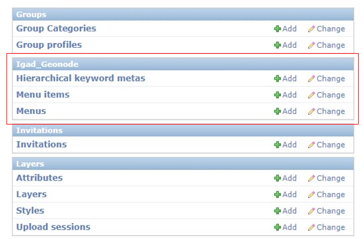

.. _custom:

Portal Customization
####################

Here you will learn how to customize the portal by adding new Thematic Areas, new Menus and Menu items. 

* **Scroll down**  the page and **Find** the *Igad_Geonode* list box. 

Creating Menus and Menu items
*****************************

These two options allow you to create new menus in the Top menu bar or in the sidebar.

Creating Menu in the Topbar
----------------------------

 #. **Click** on the *Add* icon in Menus. 

    .. figure:: img/menu.png

 #. **Fill** the requested fields then **Save** it. 

    .. figure:: img/test-menu.png
	   :scale: 50 %

 #. **Click** on the *Add* icon in Menu items. 

    .. figure:: img/item.png
	
 #. **Select** from the list the menu created previously and **Fill** the other fields then **Save** it. 
    
	.. figure:: img/test-1.png
	   :scale: 50 %
	
 #. **Navigate** to the welcome page of the portal. You will find the menu created and its item in the top menu bar.
 
    .. figure:: img/test-menu-1.png
	   :scale: 50 %

Creating Menu in the Sidebar
----------------------------

 #. **Click** on the *Add* icon in Menus. 

    .. figure:: img/menu.png

 #. **Fill** the requested fields then **Save** it. 

    .. figure:: img/sidebar.png

 #. **Click** on the *Add* icon in Menu items. 

    .. figure:: img/item.png

 #. As an example let us create a menu item as an external link to Google. **Fill** the requested fields then **Save** it. 

    .. figure:: img/google.png

 #. **Navigate** to explore data from the main page of the portal. You will find the menu created in the sidebar. 

    .. figure:: img/googlemenu.png
       :scale: 50 %
   
 #. By clicking on *Test google URL*, you will be addressed to the site of google.

   
Creating New Thematic Areas and Keywords
****************************************

Here you will learn how to create new Thematic Areas and its related keywords following a hierarchy or to manage already existing ones. Let us begin following a structured procedure to create a hierarchy from A to Z.

 #. **Click** on the *Add* icon.  

    .. figure:: img/add.png

 #. On the new page, **Click** the + icon to create a new Thematic Area (the head of the hierarchy). 

    .. figure:: img/+.png

 #. **Fill** the requested fields, for example as the figure below then **Save** it.

    .. figure:: img/head.png 

 Now you can find the created Thematic Area within the list.

 #. **Select** *Test Thematic Area* from the Hkeyword list. **Fill** the requested metadata fields then **Save** it. These fields allow you to describe and customize your Thematic area by adding a Title, Description, an Icon etc..  

    .. figure:: img/test.png 

 Now let us create a child in our Thematic Area.

 #. **Click** again on the + icon then **Fill** the fields as in the figure below and **Save** it.

    .. figure:: img/childtest.png 

 .. note:: Note that now *Child test* is a child relative to Test Thematic Area.

 #. **Fill** the requested metadata for the Child test fields then **Save** it.

    .. figure:: img/childmeta.png 

 #. **Return** to the main page of the IGAD portal. **Drop down** the Thematic Areas menu, you should find the thematic created before. 

    .. figure:: img/thematic.png

 #. **Enter** the Thematic Area Test by clicking on it. You will find the child created before. 

    .. figure:: img/view.png

 The child tab is empty at the moment. To assign a Layer, Document or a map to the child:

 #. As an example, **Explore** the existing layers then **Select** one. **Click** on *Edit Layer* tab.

    .. figure:: img/edit.png

 #. **Click** on *Wizard* in the pop up page. 

    .. figure:: img/wizard.png

 #. **Assign** the keyword Child test to the layer then **Update**. 

    .. figure:: img/keyword.png

 Now the Child test tab is not empty anymore and contains the assigned layer.

   .. figure:: img/layer.png

