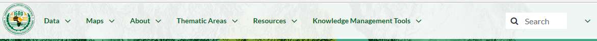

.. _geonode:

============
Geonode menu
============

**IGAD Spatial Web Portal** welcome page presents several functionalities that can be mainly accessed from the main menu bar at the top of the page. 

   *Menu bar* 

The first three menus of the menu bar (i.e. Data, Maps and About) are identical to the menus of GeoNode and will be briefly introduced in the current documentation. For further details the reader 
is referred to the `documentation of GeoNode <http://docs.geonode.org/en/master/tutorials/users/index.html>`_.   
   
   
Data
####

The **Data** *menu* contains two blocks of options. The first block includes options to view, and optionally to examine, already existing Layers, Documents and Remote Services in the portal. 
The second block allows the user to upload his own Layers, Documents or to add a Remote Service into the portal.

.. figure:: img/data.png

   *Data menu*  
   
Maps
####

The **Maps** *menu* contains two options. The first option allows the user to view and query existing Maps in the portal while the second to create his own map and save it into the portal.

.. figure:: img/maps.png

   *Maps menu*  
   
About
#####

The **About** *menu* also contains two blocks of options. The first block concerns the options to find and explore people and groups  already registered and active in the portal while  
the second to add and manage users and groups in the portal.

.. figure:: img/about.png

   *About menu*  
   
The remaining menus are suitably customized for this portal in order to manage the infrastructure of the data. It will be treated seperately and discussed in detail in the next section.   