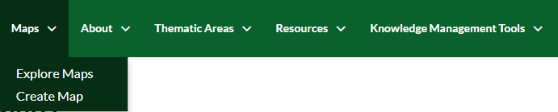

.. _maps:

=============
Managing Maps
=============

Since you are logged in, now the **Maps** *menu* contains two options. The first option allows you to view and query existing Maps in the portal as before while the second new one to create your own map and save it into the portal.

   *Maps menu*  
   

Creating Map
################

 #. **Click** on *Create Map*. An interactive WebGIS interface will open, containing:
 
    * A toolbar on the top.
    * A table of contents (TOC) or layer list on the left side.
    * A Data Frame space where layers are displayed. The Data Frame shows the OpenStreetMap basemap layer by default. There are other service layers available here such as Humanitarian OpenStreetMap, UNESCO GEODATA and UNESCO.  	

  .. figure:: img/webgis.png
     :scale: 50 %

 #. From the TOC **Click** on *Add layers*.  
 
    .. figure:: img/add.png
 
 #. From the list **Double Click** on the layers that you want to add to your map then **Click** on *Done*. 
 
    .. figure:: img/select.png
	   :scale: 50 %
 
 #. **Order** your layers by dragging the point layers on the top of the TOC then the lines and the polygons and **Choose** a basemap. 
 
    .. figure:: img/order.png
	   :scale: 50 %
	   
 #. If you want to edit the style of the active layers in the map. **Select** the target layer then **Click** on the brush icon and follow the *Steps* in **Layer Styling** section. 
 
    .. figure:: img/brush.png
 
 #. After all the edits, **Click** on the *Map* button from the toolbar then **Select** *Save Map*. 
 
    .. figure:: img/save.png
	
 #. **Assign** a name to the map and an abstract then **Click** on *Save*. 

    .. figure:: img/mapname.png 
	
 #. Your map will be approved by the administrators.
 
    .. figure:: img/pending.png 
 
Sharing Map
##############

 #. From the toolbar, **Click** on on the *Map* button then **Select** *Publish Map*.

    .. figure:: img/publish.png

 #. A new dialog will appear with instructions on how to embed this map in a webpage, including a code snippet. You can adjust the parameters as necessary.	
 
    .. figure:: img/code.png
	
 #. **Try** instead to copy and paste the http *URL* of your map in a browser. You will be able to view your map.
 
    .. figure:: img/url.png
	   :scale: 50 %
 
    