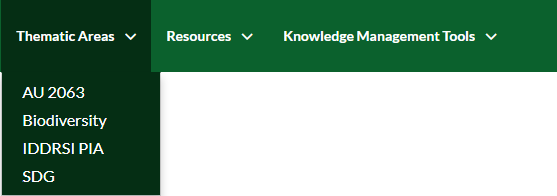
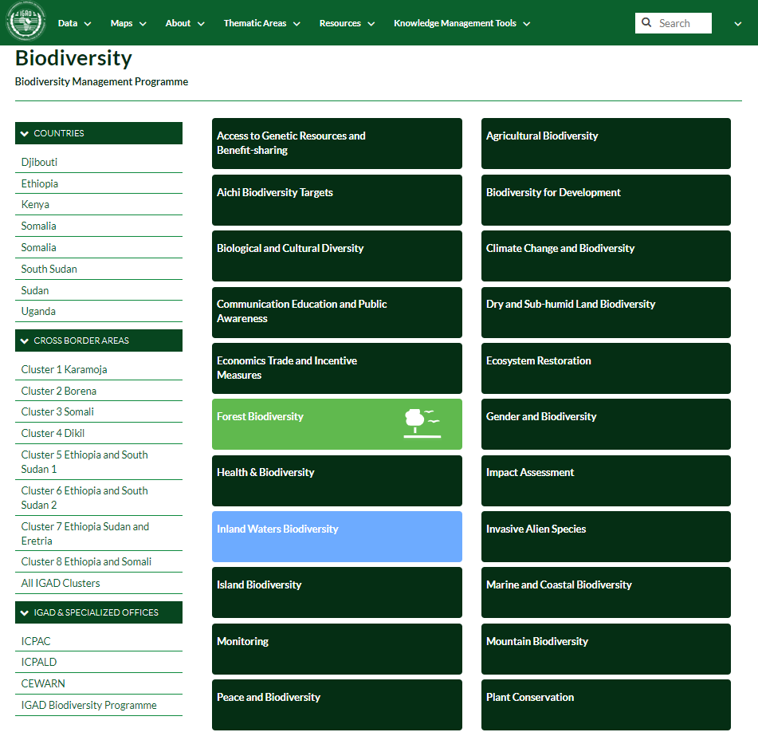

.. _topbar:

####################
Main Functionalities
####################

Without being logged in, you are limited to read-only access of public layers. Let us explore the top menu bar.

 .. figure:: img/menubar.png

   *Menu bar* 
   
The first three menus of the menu bar (i.e. Data, Maps and About) are identical to the menus of GeoNode. Further details can be found at the website of `GeoNode <http://geonode.org>`_ and its 
`documentation <http://docs.geonode.org/en/master/tutorials/users/index.html>`_.   

****
Data
****

This menu list allows the user to explore, or to manage (if logged in),  local or remote layers (vector or raster) and the associated metadata documents (such as Pdf, images, tabular data etc.).  

 #. **Drop down** the *Data* menu then **Click** on *Layers* button. 
   
      .. figure:: img/layer.png
         :scale: 50 %
   
   
 #. **Choose** a layer and **Click** on its name. 

      .. figure:: img/view.png
         :scale: 50 % 

    Here you can view the layer on a basemap, informations about the layer and other available options.  

****	
Maps
****

Maps consist in overlaying various layers and their styles. This toolbar allows you to create a map based on the uploaded layers combining them with some existing layers and a remote web service layer, 
and then (If logged in) share the resulting map for public viewing. 
	
 #. **Click** on *Maps* menu. Already existing maps will be shown.  
 
      .. figure:: img/map.png
         :scale: 50 %
		 
 #. **Choose** a map and **Click** on its name. 

      .. figure:: img/map1.png
         :scale: 50 % 

Here you can view the map, active layers of the map and other available options.

*****		 
About
*****

This menu allows you to explore people, groups and their activities within the portal and will be explained in detail in the tutorials.  

 .. figure:: img/about.png
             :scale: 50 %
			 
**************			 
Thematic Areas
**************

This platform has been created and powered by GeoNode with the aim to support mainly the Biodiversity Programme. Specifically, the 
**Thematica Areas** *menu* is customized and includes several options that contain finished and ready Geospatial data.

   *Thematic Area menu*     
   

Let us explore the contents of the options in the **Thematica Areas** *menu*. For example, **Click** the **Biodiversity** option. You will be redirected to a new page containing 
a **Sidebar** *menu* and a list of Thematic categories.    

   
Sidebar Menu
************

The **Sidebar** is divided in three groups: 

* COUNTRIES: a list of IGAD countries that allows the user to explore the layers in a specific country.
* CROSS BORDER AREAS: contains the layers that fall between the borders of the countries.
* IGAD & SPECIALIZED OFFICES: external links about IGAD Programmes.  

Thematic Categories
*******************

The **Thematic categories** tabs contain layers related to a specific created classes.

 .. note:: The color of the tab is significant. Dark green tabs are empty and does not contain any layer. 
	
**Click** the *Forest Biodiversity* tab. You will be adressed to a new page that shows the layers related to the current tab. 

 .. figure:: img/tab.png

   *Layers in the Forest Biodiversity tab*   
   
Moreover, a new sidebar menu will appear based on several filters. 

Sidebar Filters 
***************

There are two ways to apply filters: 

1. OR type filter: 

 * **Navigate** to the **Data** *menu* and **click** on the layers option to explore all the existing layers in the portal (see *Fig. 1*).  

   .. figure:: img/keywords.png
      :align: center
      :scale: 30 %
   
      *Fig. 1*

 * **Expand** the **KEYWORDS** *Filter*. **Select**, for example, *actualevap* item (will be highlighted in blue), all the layers related to the selected option will be found (see *Fig. 2*).

   .. figure:: img/actualevap.png
      :align: center
      :scale: 30 %
   
      *Fig. 2*   
   
 * Next **Select** the keyword *administrative*, further layers related to the selected keys will be added to the selection (see *Fig. 3*).

   .. figure:: img/administrative.png
      :align: center
      :scale: 30 %
   
      *Fig. 3*     
   
 .. note:: Note that filtering the data using many keywords will apply an **OR** filter.   

2. AND type filter:

 * **Click** on *Clear* to reset the filters. You will be redirected to the main layers page as in *Fig. 1*.  

 * **Expand** the **OWNER** *Filter*. **Select**, for example, *igad* item, all the layers related to the selected item will be found (see *Fig. 4*).

   .. figure:: img/igad.png
      :align: center
      :scale: 50 %
   
      *Fig. 4*   
   
 * Next **Expand** the *TYPE* *Filter* and **Select** *Vector Layers* item. Layers that are owned by *igad* **AND** are vectors will be selected only (see *Fig. 5*).

   .. figure:: img/vector.png
      :align: center
      :scale: 50 %
   
      *Fig. 5*     
   
 .. note:: Note that filtering the data using items from different filters lists will apply an **AND** filter.
   
*********			 
Resources
*********

This menu contains documentations, training materials and publications.

 .. figure:: img/resources.png
    :scale: 80 %

**************************			 
Knowledge Management Tools
**************************

This menu contains links that are related to IGAD programmes.

 .. figure:: img/links.png
    :scale: 70 %
