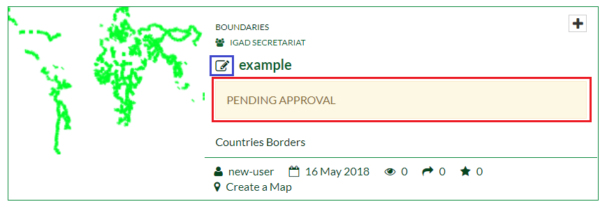

.. _layer:

=============
Managing Data
=============

A layer is a slice or stratum of the geographic reality. Layers are a published resource representing a raster or vector spatial data source. 
Layers also can be associated with metadata, ratings, and comments. This section will introduce you how to upload, download, change the style or share a layer.
 
Uploading layers
################

The following steps will explain how to upload your own layer. For example you can download a shapefile from the net. A shapefile format (.shp) can spatially describe vector features: 
points, lines, and polygons, representing, for example, point of interests, roads, and buildings. After downloading the shapefile:

 #. From the top menu, **Scroll down** the *Data* menu then **Click** on *Upload Layer*. This will open the upload form.
 
    .. figure:: img/data.png
	
       *Data menu*
	   
   
    .. note:: Note that, since you are logged in, now the **Data** *menu* contains two blocks of options. The first block includes options to view, and optionally to examine, already existing Layers, Documents and Remote Services in the portal. 
              The second block allows the user to upload his own Layers, Documents or to add a Remote Service into the portal.

 #. **Click** on the *Choose Files* button. Navigate to your data folder and select all of the four files composing the shapefile (.shp, .dbf, .shx, .prj). 
    Alternatively you could drag and drop the four files in the *Drop files here* area. You can also upload a zipped folder containing the files above. 

    .. figure:: img/form.png
 
 #. On the right side of the form, you can set the permissions on who can view, download, edit and manage the layer.     
   
    .. figure:: img/permissions.png

 #. **Click** on *Upload Files*. Your file will be uploaded in the portal. Once approved by the administrators, you will get notified and will be viewable by other users.

    .. figure:: img/upload.png 

 
Edit Layer Metadata
###################

In order to change the metadata of the layer, from the tabs shown in *Step 4*: 

 #. **Click** on *Edit Metadata*. You will be addressed to the following wizard. The first two pages are mandatory while the last two are optional.

    .. figure:: img/wizard.png
       :scale: 60 %

 #. On the first page, **Fill** the form by adding an *Abstract*. **Assign** the appropriate *Keywords*, a *Category* and a *Group* related to the layer. You can also edit the *Thumbnail*. 

    .. figure:: img/metadata.png
       :scale: 60 %
 
 #. On the second page, you can set the language, the license, Data quality and the restrictions. **Fill** the required fields.  
    
	.. figure:: img/metadata1.png
	   :scale: 60 %
    
 #. On the third page which is optional, you can add further metadata such as the purpose, temporal extent and the spatial representation of the layer.  	

    .. figure:: img/metadata-3.png
	   :scale: 60 %

 #. The fourth page named *Dataset Attributes* is optional but important since it allows you to compute some edits on the attribute table such as the labels and the order of the features. Adding a label to the 
    attribute will speed up the process of the *GetFeatureInfo* operation.  **Click** on *Update* after finishing your edits.
	
	.. figure:: img/attribute.png
	   :scale: 60 %

 #. After updating the metadata you will be redirected to the preview page. **Click** on the *Attributes* tab to see your modified table. **Click** on *GetFeatureInfo* icon highlighted in the figure below and point it 
    to a modified element. Note that the *GetFeatureInfo* will show you now the label added before.  

    .. figure:: img/feature.png
	   :scale: 60 %	
 
 #. Finally, you can also print your map layer by clicking on the *Print* icon. 
 
    .. figure:: img/print.png
	   :scale: 60 %
	   
Layer Styling
#############

First let us create a new style and assign it to the layer, next we will see how to manage existing styles. 

Creating New Style
******************

 #. From the preview page, **Click** on *Edit Layer*. A pop window will open, in *Styles* you can edit the style, upload your own style (as an SLD) or manage the existing styles.
 
    .. figure:: img/popup.png
	
 #. **Click** on *Edit*. A pop up window will open. Under the *Styles* part **Click** on *Add* to create a new line style. **Assign** a title and optionally 
    an abstract then **Save** it. 
  
    .. figure:: img/editstyle.png  
	
 #. Under the *Rules* part **Select** the *Untitled 1* rule then **Click** on *Edit*. On the new window under the *Basic* tab you can change the name, style, colors, width and other properties. 
 
    .. figure:: img/dash.png 
	
 #. **Change** the properties of the style then **Click** on *Save*. The style of the layer will be updated. 

    .. figure:: img/green.png 
	   :scale: 50 %

Managing Styles
***************
	   
 #. As in *Steps 1 - 2* in *Creating New Style*, now **Click** on *Manage* button instead. **Choose** an available style then **Click** on it. It will be automatically added to right list. **Set** it as *Layer Default Style*
    then **Click** on *Update Available Styles*.      
   
    .. figure:: img/style.png
	
Once you have finished all your edits on the layer. **Return** to the welcome page and **Explore** your layer, only you will be able to visualize it since it still in a *Pending Approval* state. 

In the figure above, The icon highlighted in blue means that the layer was uploaded from a local machine. 

Managing Remote Services
########################

A Web map service (WMS) is a standard protocol that describes how to serve any georeferenced map images over the Internet, which is usually generated by a map server that uses data from a geographic information system database. 
WMS provides a simple way of requesting geo-registered map images using an HTTP interface.

IGAD portal allows the user to make use of data via a connection to a remote service (to a server). Let us start to see how to add a remote service.

Adding Remote Service
*********************   

From the top bar, **Scroll down** the *Data* menu then **Click** on *Add Remote Service*.  
 
 .. figure:: img/add-service.png
	
On the new page, you should provide a *Service URL* in order to connect to the server and a *Service Type*. There are three available service types. 

  * Web Map Service (WMS)
  * GeoNode WMS
  * ArcGIS REST MapServer	

Adding Web Map Service
----------------------

 #. Let us connect, for example, to GeoServer at the following URL: https://demo.geo-solutions.it/geoserver/ows?service=wms&version=1.3.0&request=GetCapabilities.  **Copy** the URL in the *Service URL* field and 
    **Select**	*Web Map Service* as a Service Type. **Click** on *Create*. 
	
	.. figure:: img/wms.png

 #. You will be connected to GeoServer and on the new page you will be able to view and to import any layer contained in the server. **Check** the flag box on a layer then **Click** on *Import Resources*. 

    .. figure:: img/layer-server.png
	   :scale: 50 %
	
 #. **Click** on *Back to service details*. **Click** on the imported layer, you will be addressed to the layer preview page where you can edit it or create a map from it.   
        
	.. figure:: img/geoserver-service.png
	
 #. From the top bar, Explore all the available layers. You should find the imported layer. The highlighted icon in the figure below shows that the layer comes from a remote service.
	
    .. figure:: img/remote.png
	   :scale: 50 %

Adding GeoNode WMS 
------------------

 #. Now, let us connect to GeoNode WMS using the following URL:  http://ihp-wins.unesco.org/geoserver/ows. As above **Add** a new service using the latter link and **Choose** GeoNode as service type. 

    .. note:: Note that the provided URL now is different than the link in the first section. GeoNode will try to extract all the layers from the service and its metadata without pointing out in the URL the 
              service type, the version	and the request. 
			  
 #. **Import** a layer and **Visualize** it. You will see that GeoNode WMS has imported also all the available info and metadata.  

    .. figure:: img/geonode-service.png

Adding ArcGIS REST MapServer
----------------------------

Dealing with ArcGIS REST services has some limitations and will be illustrated now. 

 #. As an example, consider the following link https://gis1.servirglobal.net/arcgis/rest/services which is a remote service directory containing 
    several layers. 

    .. figure:: img/arcgis.png
   
 #. **Add** a new remote service using the link above. **Select** ArcGIS REST MapServer as a Service Type then **Create**. You will receive the following error. 
    This is due to the indexing structure of the service.      
 
    .. figure:: img/arcgis-type.png	
	
 #. In order to avoid this error, one should point directly the root of the desired layer, for example, 
    https://gis1.servirglobal.net/arcgis/rest/services/Africa/Africa_Ecosystems/MapServer. **Create** a new service using the latter link.
	
	.. figure:: img/root-service.png	
 
 #. **Explore** the imported layer from the service. You will note that the *Legend* was not imported along the layer and thus you will not be able to change the style. 
    
	.. figure:: img/limitations.png	
	   :scale: 50 %
   
 #. Finally, the layer will **not** be printable. 

    .. figure:: img/no-print.png	
	   :scale: 50 %

	   
Exploring Remote Services
*************************

 #. **Scroll down** the *Data* menu then **Click** on *Remote Services*.  
 
    .. figure:: img/remote-service.png
	
 #. **Check** the remote services in the portal created by other users.  
 
    .. figure:: img/remote-services.png
	
 #. As a basic user you can only edit or delete your own created services. You can take advantage of the remote services added by other users importing from it some data.

    .. figure:: img/import.png
     